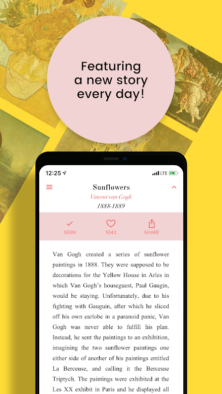
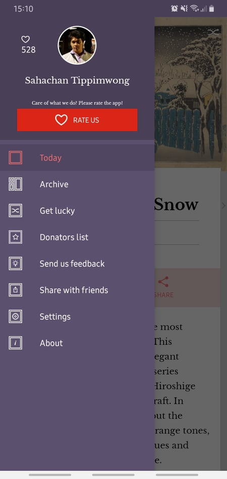

# se494_first_assignment 📱

## The Assignment 🖊

Choose one application from any store, implement one of its interface. Explain about the widget that you use and explain about the widget tree  to create the application's interface.

### The submission would be 📜

1. the capture screen of the application

2. flutter code that is already clean

3. .apk file (you can upload [here](https://drive.google.com/drive/u/4/folders/1pfTQqbbiHfTwP2DYEweR25uzELjwtnVk))

4. widget's explanation

### The point would be

easy / hard 5 points

complete + correct 5 points

## My Work 🛠

### 🖼 Application: [`DailyArt`](https://play.google.com/store/apps/details?id=com.moiseum.dailyart2)

### 🤖 The interface : `Daily Painting Screen`

their screen

